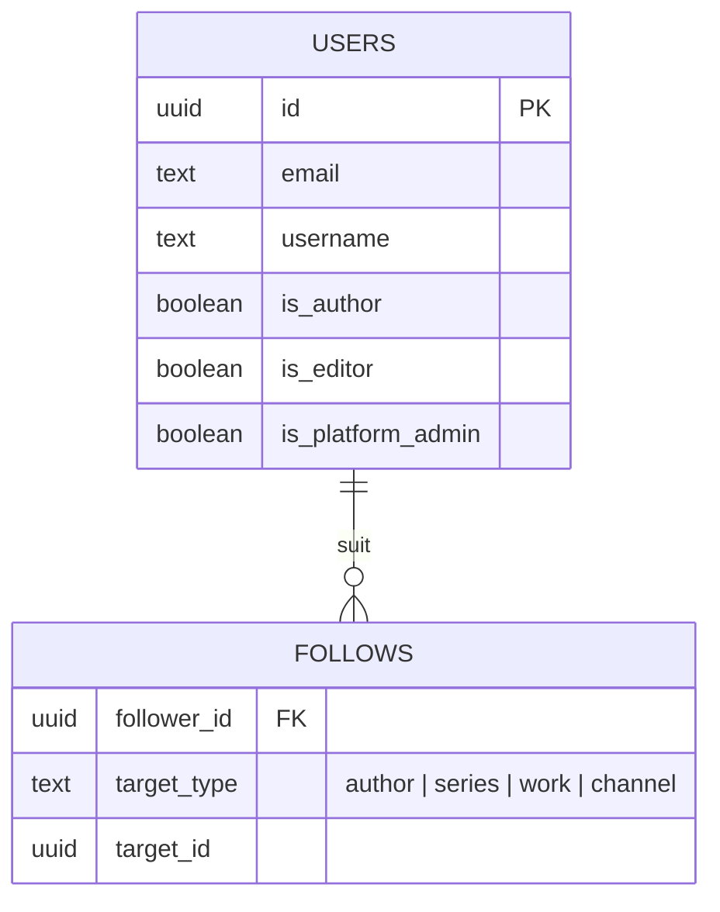
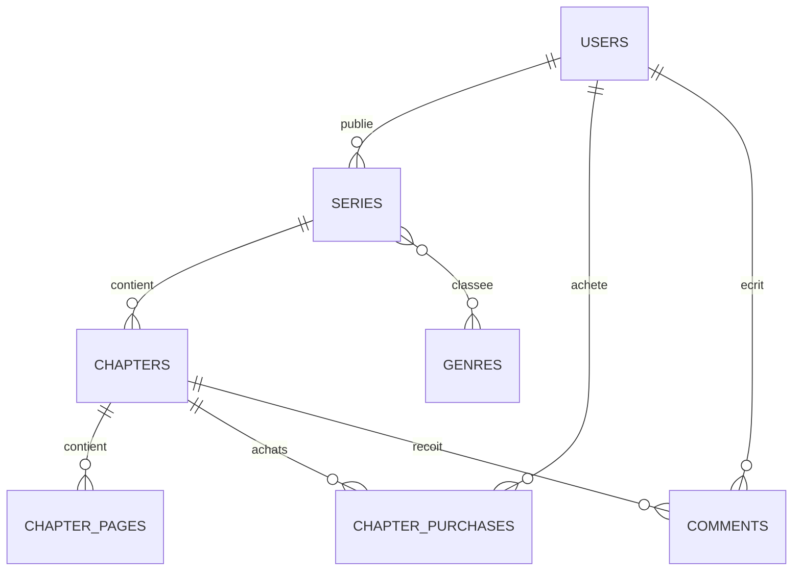
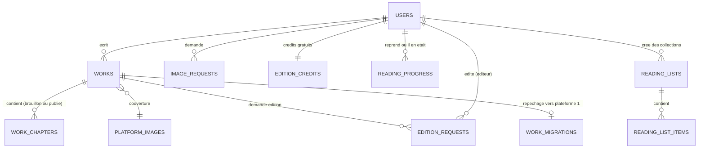
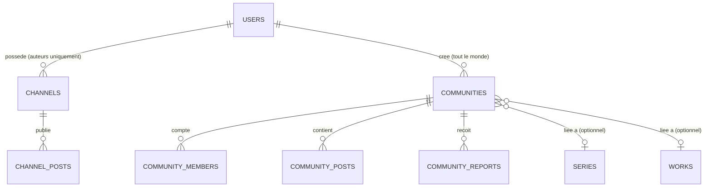

# Architecture base de données — 3 plateformes, 1 compte utilisateur

## Statut : Supabase provisionné et testé

- **Projet** : `hypercube-obsidian` (ref `pcbjqxogwbjqcskwygpf`), région
  `us-east-1`, organisation gratuite (0 $/mois).
- **URL** : `https://pcbjqxogwbjqcskwygpf.supabase.co`
- Le schéma complet (23 tables, triggers, Row Level Security) a été
  **appliqué pour de vrai** sur ce projet, pas juste écrit sur papier :
  inscription simulée → création automatique du profil + des 4 crédits
  d'édition gratuits → vérifié → nettoyé. RLS est activé sur les 23 tables.
- Fichier source de vérité pour Supabase : `supabase/migrations/` (convention
  du CLI Supabase — une nouvelle modif = une nouvelle migration, jamais
  éditer un fichier déjà appliqué). `database/supabase_schema.sql` en est une
  copie de lecture. `database/schema.sql` reste la version "PostgreSQL
  générique" (sans dépendance à `auth.users` de Supabase), gardée comme
  référence si le projet change un jour de backend.
- Variables d'environnement front-end : voir `.env.example` à la racine —
  **les 3 plateformes utilisent exactement les mêmes valeurs**, c'est ce qui
  fait qu'un compte est partagé entre elles.
- Migrations additionnelles appliquées pour la plateforme 2 : tags libres et
  brouillon/publié sur les chapitres, `reading_progress` (reprise de
  lecture), `reading_lists` (collections perso), une fonction sécurisée
  `decrement_edition_credit` (empêche un utilisateur de remonter son propre
  crédit d'édition), et un bucket de stockage `work-covers` (upload de
  couverture depuis l'appareil, public en lecture, écriture limitée à son
  propre dossier).
- **Limite de test connue** : cet environnement ne peut pas atteindre
  `*.supabase.co` en HTTP direct (même restriction réseau que pour les CDN
  d'images plus haut) — donc je n'ai pas pu screenshot l'app avec de vraies
  requêtes réseau. J'ai contourné en interceptant les appels côté navigateur
  (Playwright `page.route`) avec des réponses simulées pour vérifier le
  rendu, et validé la logique serveur (triggers, RLS, RPC) directement via
  le SQL exécuté sur le vrai projet. Le vrai test réseau ne pourra se faire
  que depuis ton navigateur, une fois déployé.

## Le principe

Le client a confirmé : ce sont **3 plateformes distinctes** (3 expériences,
3 designs, potentiellement 3 domaines/sous-domaines), mais **un seul compte
utilisateur** doit fonctionner partout. C'est exactement le modèle Google
(Gmail / Drive / Docs sont 3 apps séparées, un seul compte Google) ou celui
d'un groupe avec plusieurs produits derrière un même système de connexion.

Concrètement, ça se traduit par :

- **1 seule base de données PostgreSQL**, avec une table `users` unique
  (voir `schema.sql`). N'importe laquelle des 3 plateformes peut vérifier
  si la personne connectée est déjà auteur (`is_author`), éditeur
  (`is_editor`), etc., puisque c'est la même ligne dans la même table.
- **3 front-ends déployés séparément** (3 builds, 3 URLs, 3 designs) : le
  code React de chaque plateforme reste indépendant, seule la donnée est
  commune.
- **Un point d'accès partagé à la donnée** : au minimum un service
  d'authentification commun (ou un backend unique qui sert les 3 apps).
  Pour un projet de cette taille, je recommande **un seul backend/API**
  plutôt que 3 back-ends séparés qui parleraient à la même base — ça évite
  de dupliquer la logique d'auth et les migrations de schéma trois fois.

## Comment gérer le projet concrètement

**Oui, 3 déploiements séparés** — chaque plateforme a son propre bundle
front-end, sa propre URL (ex: `lecture.tondomaine.com`,
`ecriture.tondomaine.com`, `communaute.tondomaine.com`), son propre design.
Rien à partager côté visuel.

**Structure de code recommandée pour la suite** : plutôt que 3 repos GitHub
totalement séparés dès le départ, je pars sur un **monorepo** (un seul repo,
plusieurs dossiers d'app) le temps du prototypage :

```
Bd-obsidian/
  apps/
    lecture/       ← ce qui existe déjà (renommé/déplacé)
    ecriture/      ← plateforme 2 (Wattpad-like)
    communaute/    ← plateforme 3 (réseau social)
  packages/
    ui/            ← composants partagés si le style doit rester cohérent
    api-client/    ← client HTTP commun vers le backend partagé
  database/
    schema.sql     ← ce fichier
```

Chaque dossier sous `apps/` se build et se déploie indépendamment (3
commandes de build, 3 cibles de déploiement), mais on évite de copier-coller
3 fois la config Tailwind, le client API, etc. Si un jour tu veux vraiment 3
repos séparés (par ex. pour donner accès à des équipes différentes), on peut
extraire chaque dossier vers son propre repo sans perdre l'historique git —
c'est une opération simple à faire plus tard, pas une décision à prendre
maintenant.

**Backend** : ✅ Supabase (voir "Statut" ci-dessus) — PostgreSQL managé, auth
partagée native, stockage de fichiers pour les couvertures/planches. Les 3
front-ends pointent sur le **même** projet Supabase (même URL, même clé),
donc un compte créé sur une plateforme fonctionne directement sur les 2
autres.

## Comment éviter qu'un seul repo = un seul déploiement

C'est la question à régler avant de coder les plateformes 2 et 3 : un repo
GitHub n'est pas un déploiement. Un déploiement (Vercel, Netlify, Cloudflare
Pages...) se configure avec un **dossier de départ** ("Root Directory" chez
Vercel, "Base directory" chez Netlify). Le mécanisme :

1. Le repo garde la structure monorepo (`apps/lecture`, `apps/ecriture`,
   `apps/communaute`), chaque dossier étant une app Vite/React autonome avec
   son propre `package.json`, sa propre config Tailwind, son propre
   `index.html`.
2. Sur l'hébergeur, tu crées **3 projets distincts**, tous branchés sur le
   **même repo GitHub** (`mitsukisegondconpte/Bd-obsidian`), mais chacun
   configuré avec un dossier de départ différent :

   | Projet hébergeur | Dossier de départ    | URL                          |
   |-------------------|-----------------------|-------------------------------|
   | `lecture`          | `apps/lecture`        | lecture.tondomaine.com       |
   | `ecriture`          | `apps/ecriture`       | ecriture.tondomaine.com      |
   | `communaute`        | `apps/communaute`     | communaute.tondomaine.com    |

3. Chaque projet ne build et ne sert QUE son propre dossier. Un push sur le
   repo déclenche bien 3 vérifications (une par projet), mais chaque
   hébergeur permet de **sauter le build si rien n'a changé dans son
   dossier** ("Ignored Build Step" chez Vercel, condition équivalente chez
   Netlify) — donc modifier la plateforme 1 ne redéploie pas les 2 autres.
4. Les 3 projets utilisent les **mêmes** variables d'environnement Supabase
   (`VITE_SUPABASE_URL`, `VITE_SUPABASE_ANON_KEY` — voir `.env.example`),
   c'est la base de données qui reste unique, pas le déploiement.

En résumé : **1 repo → 3 apps dans des dossiers séparés → 3 projets
d'hébergement pointant chacun sur un dossier → 3 URLs indépendantes → 1
seule base Supabase derrière les 3.** Rien à dupliquer côté code partagé
(auth, design system) si on garde le monorepo ; rien à partager côté build
ou déploiement puisque chaque projet d'hébergement est cloisonné à son
dossier.

**Statut** : les 3 apps existent (`apps/lecture`, `apps/ecriture`,
`apps/communaute`). `apps/lecture` et `apps/ecriture` sont déployées sur
Vercel (voir liens dans le README racine). `apps/communaute` reste à
déployer. Chaque app affiche un menu "Plateformes Hypercube" (icône grille
dans la navbar) qui pointe vers les URLs des 2 autres — les redirections
inter-plateformes du doc client sont donc réelles, pas juste documentées.

## Contenu du schéma (`schema.sql`)

Le schéma a été écrit puis **testé pour de vrai** sur un PostgreSQL local
(création des tables, contraintes, jointures, cas d'erreur volontaires) —
pas juste rédigé à l'aveugle.

### 1. Identité commune



### 2. Plateforme 1 — Lecture & publication



### 3. Plateforme 2 — Écriture & édition (Wattpad-like)



Fonctionnalités ajoutées par rapport au doc client (proposées et
implémentées) : `works.tags` (tags libres, découverte façon Wattpad),
`work_chapters.is_draft` (un chapitre non publié n'est visible que par son
auteur), `reading_progress` et `reading_lists` ci-dessus.

### 4. Plateforme 3 — Réseau social



Règle du client explicitement appliquée : **les auteurs créent des canaux,
les lecteurs créent des communautés/groupes** — une policy RLS bloque la
création d'un canal si `profiles.is_author` est faux.

**Vraie synchronisation entre les 3 plateformes** (pas juste "même base", du
comportement automatique) :
- Publier une série (plateforme 1) ou une œuvre (plateforme 2) passe
  automatiquement `is_author = true` sur le profil (trigger) — c'est ce qui
  débloque la création de canal sur la plateforme 3, immédiatement, sans
  action manuelle.
- Une communauté créée par l'auteur d'une œuvre pour cette œuvre est
  **certifiée automatiquement** (trigger) — un des critères de validation du
  doc client, traduit en règle de données plutôt qu'en modération manuelle.
- Accepter une proposition de repêchage (plateforme 2) poste automatiquement
  une annonce sur le canal de l'auteur (plateforme 3), si il en a un.
- La page de profil de la plateforme 3 affiche les séries (plateforme 1) et
  les œuvres (plateforme 2) d'un même compte, avec des liens directs vers
  les 2 autres apps — un seul profil, un contenu agrégé des 3 produits.

Testé directement en SQL sur le projet : un profil non-auteur qui publie une
œuvre devient auteur, une communauté "officielle" est validée à la création
alors qu'une communauté "non officielle" sur la même œuvre ne l'est pas, et
l'acceptation d'un repêchage crée bien le post sur le canal.

### Points du doc client traduits en règles de données

- **4 éditions niveau 1 gratuites puis payantes** → table `edition_credits`,
  un compteur par utilisateur, décrémenté à chaque demande.
- **Demande d'image sur mesure redirigée vers WhatsApp** → `image_requests`
  trace juste la demande et son statut, la conversation reste hors
  plateforme (`contact_channel`).
- **Repêchage d'une oeuvre par Hypercube/BM** → `work_migrations`, avec le
  lien vers la nouvelle `series_id` une fois recréée sur la plateforme 1.
- **Communauté "validée"** (comme un badge certifié) → `is_validated` +
  `community_reports` pour tracer l'absence de signalement dans le temps.

## Appliquer le schéma

Déjà fait sur le projet Supabase `hypercube-obsidian` — rien à rejouer pour
l'instant. Pour une future modification (ajout d'une table, etc.) :

```bash
# Ajouter une migration (jamais éditer un fichier déjà appliqué)
supabase migration new nom_du_changement
# éditer le fichier généré dans supabase/migrations/
supabase link --project-ref pcbjqxogwbjqcskwygpf
supabase db push
```

Pour tester en local sans toucher au projet cloud (PostgreSQL générique,
sans Supabase Auth) :

```bash
createdb hypercube
psql -d hypercube -f database/schema.sql
```
