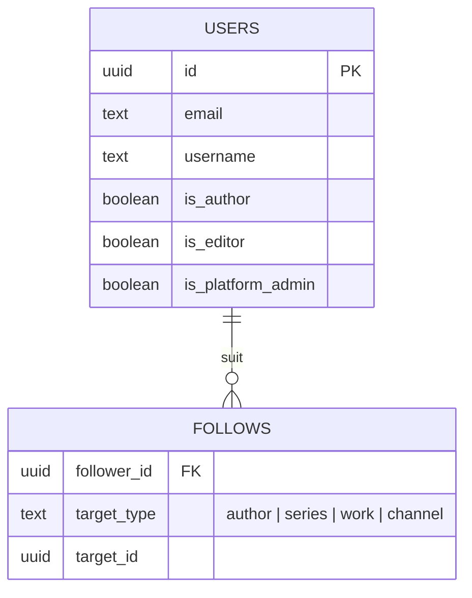
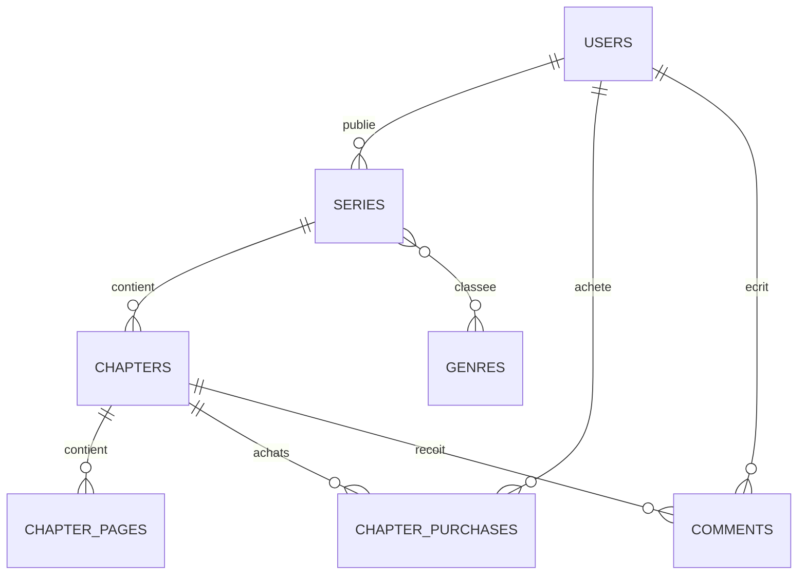
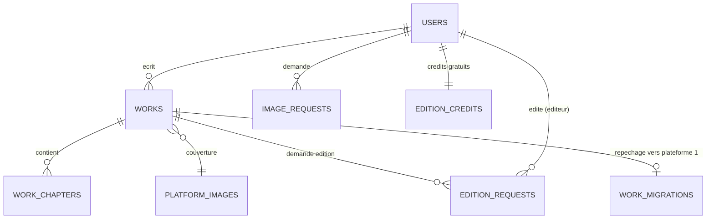
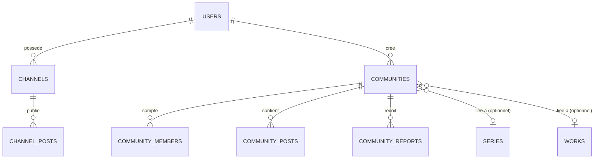

# Architecture base de données — 3 plateformes, 1 compte utilisateur

## Le principe

Le client a confirmé : ce sont **3 plateformes distinctes** (3 expériences,
3 designs, potentiellement 3 domaines/sous-domaines), mais **un seul compte
utilisateur** doit fonctionner partout. C'est exactement le modèle Google
(Gmail / Drive / Docs sont 3 apps séparées, un seul compte Google) ou celui
d'un groupe avec plusieurs produits derrière un même système de connexion.

Concrètement, ça se traduit par :

- **1 seule base de données PostgreSQL**, avec une table `users` unique
  (voir `schema.sql`). N'importe laquelle des 3 plateformes peut vérifier
  si la personne connectée est déjà auteur (`is_author`), éditeur
  (`is_editor`), etc., puisque c'est la même ligne dans la même table.
- **3 front-ends déployés séparément** (3 builds, 3 URLs, 3 designs) : le
  code React de chaque plateforme reste indépendant, seule la donnée est
  commune.
- **Un point d'accès partagé à la donnée** : au minimum un service
  d'authentification commun (ou un backend unique qui sert les 3 apps).
  Pour un projet de cette taille, je recommande **un seul backend/API**
  plutôt que 3 back-ends séparés qui parleraient à la même base — ça évite
  de dupliquer la logique d'auth et les migrations de schéma trois fois.

## Comment gérer le projet concrètement

**Oui, 3 déploiements séparés** — chaque plateforme a son propre bundle
front-end, sa propre URL (ex: `lecture.tondomaine.com`,
`ecriture.tondomaine.com`, `communaute.tondomaine.com`), son propre design.
Rien à partager côté visuel.

**Structure de code recommandée pour la suite** : plutôt que 3 repos GitHub
totalement séparés dès le départ, je pars sur un **monorepo** (un seul repo,
plusieurs dossiers d'app) le temps du prototypage :

```
Bd-obsidian/
  apps/
    lecture/       ← ce qui existe déjà (renommé/déplacé)
    ecriture/      ← plateforme 2 (Wattpad-like)
    communaute/    ← plateforme 3 (réseau social)
  packages/
    ui/            ← composants partagés si le style doit rester cohérent
    api-client/    ← client HTTP commun vers le backend partagé
  database/
    schema.sql     ← ce fichier
```

Chaque dossier sous `apps/` se build et se déploie indépendamment (3
commandes de build, 3 cibles de déploiement), mais on évite de copier-coller
3 fois la config Tailwind, le client API, etc. Si un jour tu veux vraiment 3
repos séparés (par ex. pour donner accès à des équipes différentes), on peut
extraire chaque dossier vers son propre repo sans perdre l'historique git —
c'est une opération simple à faire plus tard, pas une décision à prendre
maintenant.

**Backend** : le schéma ci-contre est écrit en PostgreSQL standard, il
marche avec n'importe quel backend (Node/Express, Django, etc.). Une option
qui irait vite pour ce projet : **Supabase** (PostgreSQL managé + auth
partagée native + stockage de fichiers pour les images de couverture) — les
3 front-ends pointeraient sur le même projet Supabase, avec sa gestion de
compte déjà prête à l'emploi. Dis-moi si tu veux partir sur cette option, je
peux le provisionner directement depuis cette session.

## Contenu du schéma (`schema.sql`)

Le schéma a été écrit puis **testé pour de vrai** sur un PostgreSQL local
(création des tables, contraintes, jointures, cas d'erreur volontaires) —
pas juste rédigé à l'aveugle.

### 1. Identité commune



### 2. Plateforme 1 — Lecture & publication



### 3. Plateforme 2 — Écriture & édition (Wattpad-like)



### 4. Plateforme 3 — Réseau social



### Points du doc client traduits en règles de données

- **4 éditions niveau 1 gratuites puis payantes** → table `edition_credits`,
  un compteur par utilisateur, décrémenté à chaque demande.
- **Demande d'image sur mesure redirigée vers WhatsApp** → `image_requests`
  trace juste la demande et son statut, la conversation reste hors
  plateforme (`contact_channel`).
- **Repêchage d'une oeuvre par Hypercube/BM** → `work_migrations`, avec le
  lien vers la nouvelle `series_id` une fois recréée sur la plateforme 1.
- **Communauté "validée"** (comme un badge certifié) → `is_validated` +
  `community_reports` pour tracer l'absence de signalement dans le temps.

## Appliquer le schéma

```bash
createdb hypercube
psql -d hypercube -f database/schema.sql
```

Ou, si tu pars sur Supabase : colle le contenu de `schema.sql` dans l'éditeur
SQL du projet Supabase (Dashboard → SQL Editor → New query).
